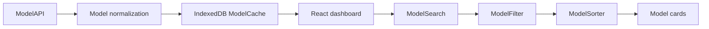
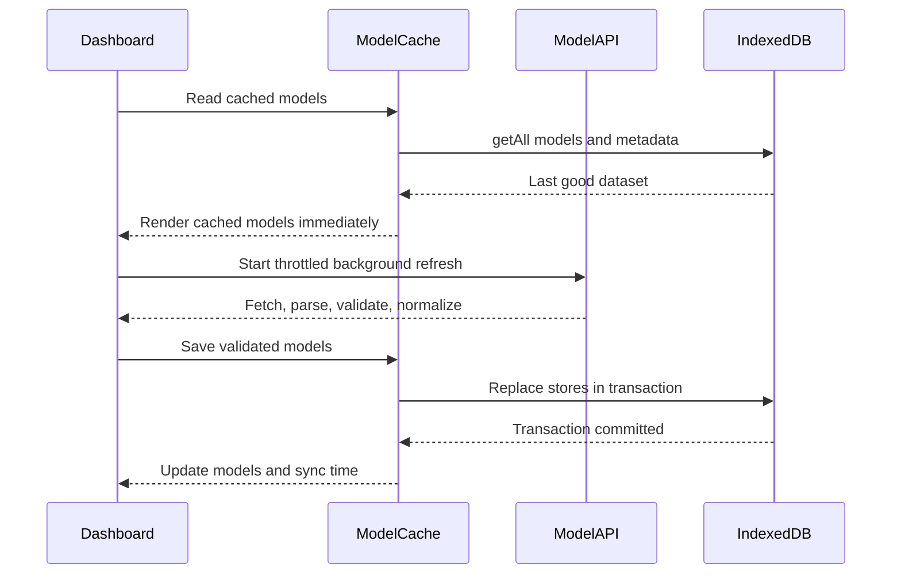

# Binaire Freznel Assessment

Binaire is an AI model discovery workspace built for the Freznel assessment. It loads model metadata, supports local search and filtering, works with cached data when offline, and provides Firebase email authentication.

Repository name: `Binaire_Freznel_Assessment`

## Features

- Model discovery from a JSON API or local JSON dataset
- Search by model name, model ID, repository name, or family
- Case-insensitive substring matching
- Debounced search input
- Throttled background refresh
- Pipeline, family, architecture, weight, and safetensor filters
- Model name and safetensor count sorting
- IndexedDB cache with metadata and last successful sync time
- Cache-first loading with background refresh
- Offline status indicator and cached fallback
- Firebase email and password sign up, login, persistence, and logout
- Adobe React Spectrum components for authentication controls
- Responsive light-mode catalog UI
- Technical metadata and repository links for each model

## Technology

- React
- JavaScript
- Vite
- Tailwind CSS
- Adobe React Spectrum
- Firebase Authentication
- IndexedDB through the `idb` package
- React Router

## Local Setup

```bash
npm install
npm run dev
```

Open the local URL printed by Vite, normally `http://localhost:5173`.

For a production build:

```bash
npm run build
npm run preview
```

## Environment Variables

Create a local `.env` file. Do not commit it.

```env
VITE_API_URL=/src/api/model-api.json
VITE_FIREBASE_API_KEY=
VITE_FIREBASE_AUTH_DOMAIN=
VITE_FIREBASE_PROJECT_ID=
VITE_FIREBASE_STORAGE_BUCKET=
VITE_FIREBASE_MESSAGING_SENDER_ID=
VITE_FIREBASE_APP_ID=
```

The project currently uses `src/api/model-api.json` so development does not depend on the remote endpoint. When the remote service is ready, replace the value with:

```env
VITE_API_URL=https://binaire.app/hf-models-api.json
```

Firebase setup:

1. Open the Firebase project used by the web app.
2. Open Build, then Authentication.
3. Enable the Email/Password provider.
4. Add the Firebase web app values to `.env`.
5. Restart Vite after changing environment variables.

Firebase browser configuration values are safe to expose in a frontend build, but environment files should still remain outside version control. Authentication rules and provider settings must be configured in the Firebase Console.

## Architecture

React components coordinate rendering and user interaction. Business behavior lives in JavaScript classes and service modules.

```text
src/
	api/ModelApi.js             API loading and response validation
	auth/firebase.js            Firebase app configuration
	auth/AuthService.js         Authentication service class
	components/                 Search, filters, cards, status, and layout UI
	filters/ModelFilter.js      Combined filter logic
	hooks/                      Online status and UI hooks
	models/                     Domain model location
	offline/ModelCache.js       IndexedDB cache service
	pages/Models.jsx            Dashboard state coordinator
	search/                     Search logic location
	sorting/ModelSorter.js      Non-mutating sort logic
	utils/                      Debounce and throttle utilities
```

### OOP Responsibilities

- `Model` normalizes inconsistent API records.
- `ModelAPI` loads, validates, and converts API records.
- `AuthService` owns Firebase authentication operations.
- `ModelCache` owns IndexedDB persistence and metadata.
- `ModelSearch` owns name and family matching.
- `ModelFilter` owns combined filter behavior and dynamic options.
- `ModelSorter` owns copied-array sorting.

## Search, Filter, and Sort Pipeline

The dashboard processes the complete cached or freshly loaded dataset in this order:

1. Search by name, ID, repository, or family.
2. Apply all active filters together.
3. Sort a copied result array.
4. Render the resulting models.

Search input is debounced by 350 milliseconds. This prevents filtering on every keystroke while keeping the interface responsive.

## How Fetch Works Without async-await

The API layer uses the browser `fetch` API with Promise chaining. `async` and `await` are not required for fetch operations.

The flow is:

```js
fetch(url)
	.then((response) => {
		if (!response.ok) {
			throw new Error("Request failed");
		}
		return response.json();
	})
	.then((payload) => normalizeModels(payload))
	.catch((error) => handleError(error));
```

This approach handles asynchronous work using the same Promise returned by `fetch`. Each `.then()` receives the result from the previous step, and `.catch()` handles network, HTTP, parsing, and validation failures.

## Large JSON Safety and Corruption Prevention

The application does not write data to the existing cache as bytes arrive. It follows a validation-first process:

1. Request the JSON response.
2. Validate `response.ok`.
3. Check that the response is JSON when a content type is available.
4. Parse the complete JSON document.
5. Validate that the payload contains an array or a supported collection property such as `models`, `data`, `items`, or `results`.
6. Normalize every record into a `Model` instance.
7. Reject invalid or suspicious data before cache replacement.
8. Preserve the old cache when parsing, validation, or normalization fails.
9. Reject an empty replacement when an existing non-empty cache is available, unless empty results are explicitly allowed.
10. Replace the model store and metadata within one IndexedDB readwrite transaction.

The cache stores the last successful sync time, record count, and cache version. If a download is interrupted or the JSON is corrupted, the previous good dataset remains available for offline use.

## Data Flow Diagram



## Cache Refresh Sequence



## Offline Behavior

When the browser is offline, the dashboard stops background refresh and continues using IndexedDB data. Search, filtering, and sorting run locally against the cached model instances. The interface shows an offline status and does not block access to the cached catalog.

## API Data Assumptions

The normalizer supports the supplied model format, including:

- `id`
- `display_name`
- `huggingface_repo`
- `repo_url`
- `family`
- `use_case`
- `architecture_category`
- `weight_format`
- `safetensor_file_count`
- `hf_tags.pipeline_tag`

It also supports common alternative names so the API can evolve without coupling React components to raw response fields.

## Project Notes

- The local JSON file is used while the remote endpoint is unavailable.
- No fake model records are generated by the application.
- Large API payloads are stored in IndexedDB, never localStorage.
- React components handle presentation. Business logic remains in classes and services.
- The Adobe React Spectrum dependency is used for accessible authentication controls and application buttons.

## Known Assumptions

- Firebase Email/Password authentication is enabled manually in the Firebase Console.
- The API response is either an array or an object containing a supported collection property.
- Some records report safetensor counts as `TBD`; those records sort as zero but display `TBD` in the interface.
- Downloads and likes are optional because they are not present in every supplied record.

## Screenshots

Add screenshots of the landing page, authentication flow, and model catalog here.
